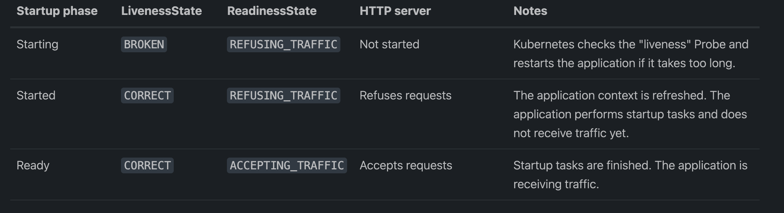
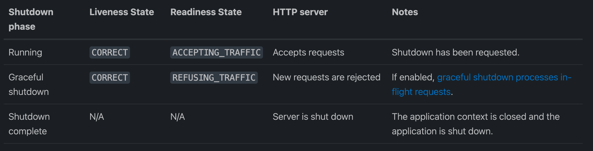

## 1. 引言

在云原生应用开发中，健康检查是确保微服务可靠性和稳定性的关键环节。特别是在 Kubernetes 这样的容器编排平台上，通过健康检查可以有效地监控和管理应用程序的状态，及时发现并处理潜在的故障情况，从而确保整个系统的正常运行。

而 Spring Boot 作为一种流行的 Java 微服务框架，其在 Kubernetes 上的部署和健康检查配置也是开发者们关注的焦点。本文将针对这一问题，提供一套完整的实战指南，帮助读者深入了解在 Kubernetes 环境中部署 Spring Boot 微服务并实施健康检查的步骤和方法。

## 2. 原理

### 2.1 Kubernetes健康检查机制

Kubernetes中的健康检查主要使用 就绪性探针 `readinessProbe` 、存活性探针 `livenessProbe` 和启动探针 `startupProbe` 来实现，service即为负载均衡，k8s保证 service 后面的 pod 都可用，是k8s中自愈能力的主要手段，主要基于这两种探测机制，可以实现如下需求：

- 异常实例自动剔除，并重启新实例。
- 多种类型探针检测，保证异常pod不接入流量。
- 不停机部署，更安全的滚动升级。

#### 2.1.1 探针类型

针对运行中的容器，`kubelet` 可以选择是否执行以下三种探针，以及如何针对探测结果作出反应：

- **livenessProbe:** 指示容器是否正在运行。如果存活态探测失败，则 kubelet 会杀死容器， 并且容器将根据其`重启策略`进行重启。如果容器不提供存活探针，则默认状态为 Success。
- **readinessProbe:** 指示容器是否准备好为请求提供服务。如果就绪态探测失败， 端点控制器将从与 Pod 匹配的所有服务的端点列表中删除该 Pod 的 IP 地址。初始延迟之前的就绪态的状态值默认为 `Failure`。 如果容器不提供就绪态探针，则默认状态为 `Success。`
- **startupProbe:** 指示容器中的应用是否已经启动。如果提供了启动探针，则所有其他探针都会被 禁用，直到此探针成功为止。如果启动探测失败，kubelet 将杀死容器，而容器依其`重启策略`进行重启。 如果容器没有提供启动探测，则默认状态为 `Success。`

#### 2.1.2 探针结果

每次探测都将获得以下三种结果之一：

- **Success（成功）:** 容器通过了诊断。
- **Failure（失败）:** 容器未通过诊断。
- **Unknown（未知）:** 诊断失败，因此不会采取任何行动。

#### 2.1.3 探针检查机制

使用探针来检查容器有四种不同的方法。 每个探针都必须准确定义为这四种机制中的一种：

- **exec：** 在容器内执行指定命令。如果命令退出时返回码为 0 则认为诊断成功。
- **grpc：** 使用 gRPC 执行一个远程过程调用。 目标应该实现 gRPC 健康检查。 如果响应的状态是 "SERVING"，则认为诊断成功。
- **httpGet：** 对容器的 IP 地址上指定端口和路径执行 HTTP GET 请求。如果响应的状态码大于等于 200 且小于 400，则诊断被认为是成功的。
- **tcpSocket：** 对容器的 IP 地址上的指定端口执行 TCP 检查。如果端口打开，则诊断被认为是成功的。 如果远程系统（容器）在打开连接后立即将其关闭，这算作是健康的。

### 2.2 Spring Boot对Kubernetes容器探针的支持

Spring Boot 2.3 版本引入了容器探针功能，其中包括了 `/actuator/health/liveness` 和 `/actuator/health/readiness` 这两个健康检查路径。这些路径是为了更好地支持部署在 Kubernetes 等容器环境中的应用程序。

- `/actuator/health/liveness` 用于存活性检查，用于确定应用程序是否仍然在运行。
- `/actuator/health/readiness` 用于就绪性检查，用于确定应用程序是否准备好接收流量。

Spring Boot Actuator 会自动将这两个路径暴露出来，并通过它们来执行相应的健康检查。这样，当你在 Kubernetes 中部署 Spring Boot 应用程序时，Kubernetes 可以利用这些路径来确定容器是否健康和准备好接收流量。

这种集成简化了在 Kubernetes 中部署 Spring Boot 应用程序的流程，并提高了应用程序的可靠性和可用性。

#### 2.2.1 Spring Boot 如何识别k8s环境

Spring Boot 通过检查环境中的 `"*_SERVICE_HOST"` 和 `"*_SERVICE_PORT"` 变量来自动检测 Kubernetes 部署环境。也可以使用 `spring.main.cloud-platform` 配置属性覆盖此检测。

Spring Boot 识别到 Kubernetes 环境后，Spring Boot Actuator 会自动将`/actuator/health/liveness` 和 `/actuator/health/readiness`这两个端点暴露出来。

>小技巧：本地验证这一特性可以通过手动设置 *KUBERNETES_SERVICE_HOST* 和 *KUBERNETES_SERVICE_PORT* 这两个环境变量来开启存活和就绪检查。访问 *http://localhost:8080/actuator/health/liveness* 响应200状态码时代表已开启。

#### 2.2.2 Spring Boot 与k8s容器探针的结合

默认情况下，Spring Boot 管理应用程序可用性状态。如果部署在 Kubernetes 环境中，Actuator 会从收集“Liveness”和“Readiness”信息，并将该信息用于各类专用的 `HealthIndicators`。

Kubernetes 存活与就绪检查配置示例：

```yaml
livenessProbe:
  httpGet:
    path: "/actuator/health/liveness"
    port: <actuator-port>
  failureThreshold: ...
  periodSeconds: ...

readinessProbe:
  httpGet:
    path: "/actuator/health/readiness"
    port: <actuator-port>
  failureThreshold: ...
  periodSeconds: ...

```

> <actuator-port> 应设置为 actuator endpoints 的端口。它可能是 Web 服务器端口或为 Actuator 单独设置的端口。通过 "management.server.port" 配置指定。


#### 2.2.3 Spring Boot 生命周期与探测状态

Kubernetes Probes 支持的一个重要方面是它与应用程序生命周期的一致性。（应用程序的内存中内部状态）和实际探针（公开该状态）之间存在显着差异。根据应用程序生命周期的阶段，探测器可能不可用。

Spring Boot 在启动和关闭期间发布 *Application Events*，探测器可以监听此类事件并暴露 *AvailabilityState* 信息。

下表显示了AvailabilityState和HTTP连接器在不同阶段的状态。

当 Spring Boot 应用程序启动时：


当 Spring Boot 应用程序 关闭时:


## 3. 准备工作

在开始部署 Spring Boot 微服务到 Kubernetes 之前，我们首先需要准备好以下工作环境和所需工具：

- 一个运行正常的 Kubernetes 集群，可以是本地的 minikube 集群或者云上的托管 Kubernetes 服务。
- 已经构建好的 Spring Boot 应用程序的 Docker 镜像，可以通过 Dockerfile 构建，或者使用 Maven 插件和 Docker 插件直接构建。
- Kubernetes 部署和服务资源的 YAML 配置文件，用于定义应用程序的部署、服务和健康检查配置。

## 4. 在 Kubernetes 中部署 Spring Boot 微服务

在准备工作完成之后，我们就可以开始在 Kubernetes 中部署 Spring Boot 微服务了。首先，我们需要创建一个 Kubernetes 部署资源，用来描述应用程序的容器镜像、副本数等信息。接下来，我们再创建一个 Kubernetes 服务资源，用来暴露应用程序的网络端口，以便其他服务可以访问到该应用程序。让我们一起来看看具体的操作步骤：

- **创建 Kubernetes 部署资源：** 在 Kubernetes 中，部署资源用于定义应用程序的部署策略和运行配置。我们可以通过一个 YAML 配置文件来创建一个部署资源，示例配置文件如下所示：

```yaml
apiVersion: apps/v1
kind: Deployment
metadata:
  name: my-springboot-app
spec:
  replicas: 3
  selector:
    matchLabels:
      app: my-springboot-app
  template:
    metadata:
      labels:
        app: my-springboot-app
    spec:
      containers:
      - name: my-springboot-app
        image: your-docker-registry/my-springboot-app:latest
        ports:
        - containerPort: 8080
```

在这个示例中，我们定义了一个名为 `my-springboot-app` 的 Deployment 资源，指定了要运行的容器镜像和副本数，并暴露了容器的 8080 端口。

- **创建 Kubernetes 服务资源：** 在 Kubernetes 中，服务资源用于定义应用程序的网络访问方式和负载均衡策略。我们同样可以通过一个 YAML 配置文件来创建一个服务资源，示例配置文件如下所示：

```yaml
apiVersion: v1
kind: Service
metadata:
  name: my-springboot-app-service
spec:
  selector:
    app: my-springboot-app
  ports:
    - protocol: TCP
      port: 80
      targetPort: 8080
  type: LoadBalancer
```

在这个示例中，我们定义了一个名为 `my-springboot-app-service` 的 Service 资源，通过 `selector` 字段指定了要负载均衡的 Deployment，并将容器的 8080 端口映射到了服务的 80 端口。

通过上述步骤，我们就可以成功地在 Kubernetes 中部署了一个运行 Spring Boot 微服务的容器应用程序。接下来，我们将重点关注如何配置和实施健康检查，以确保应用程序的稳定性和可靠性。

## 5. 配置健康检查

在 Kubernetes 中，健康检查通过 liveness 探针和 readiness 探针来实现。liveness 探针用于检查应用程序是否处于运行状态，而 readiness 探针用于检查应用程序是否已准备好接收流量。下面我们将分别介绍如何在 Spring Boot 应用程序中实现这两种探针，并在 Kubernetes 中进行配置。

- **实现 liveness 探针：** 在 Spring Boot 应用程序中实现 liveness 探针非常简单，我们只需创建一个端点接口，用于检查应用程序的运行状态即可。例如，我们可以创建一个 `/actuator/health` 的端点，用于返回应用程序的健康状态。在 Spring Boot 应用程序中，我们可以通过 Spring Boot Actuator 模块来实现这一功能。在 `application.properties` 配置文件中添加以下配置：

```properties
management.endpoint.health.enabled=true
management.endpoint.health.probes.enabled=true
management.endpoints.web.exposure.include=health
```

然后，我们就可以访问 `/actuator/health` 端点来检查应用程序的运行状态了。

- **实现 readiness 探针：** 与 liveness 探针类似，实现 readiness 探针也很简单。我们可以创建一个类似的端点接口，用于检查应用程序是否已准备好接收流量。例如，我们可以创建一个 `/actuator/readiness` 的端点，用于返回应用程序的就绪状态。同样地，我们可以通过 Spring Boot Actuator 模块来实现这一功能，在 `application.properties` 配置文件中添加以下配置：

```properties
management.endpoint.health.enabled=true
management.endpoint.health.probes.enabled=true
management.endpoint.health.probes.include=readiness
```

然后，我们就可以访问 `/actuator/readiness` 端点来检查应用程序的就绪状态了。

- **在 Kubernetes 中配置健康检查：** 在 Kubernetes 的部署配置文件中，我们可以通过 `livenessProbe` 和 `readinessProbe` 字段来定义容器的健康检查。例如，我们可以使用以下配置来定义一个 liveness 探针：

```yaml
livenessProbe:
  httpGet:
    path: /actuator/health
    port: 8080
  initialDelaySeconds: 30
  periodSeconds: 10
```

这个配置将会在容器启动后等待 30 秒后开始进行 liveness 探测，每隔 10 秒进行一次探测，检查 `/actuator/health` 端点的返回状态。

类似地，我们也可以使用类似的配置来定义一个 readiness 探针。

通过上述步骤，我们就成功地在 Spring Boot 应用程序中实现了 liveness 探针和 readiness 探针，并在 Kubernetes 中进行了相应的配置。接下来，我们将进行实战演练，验证健康检查的配置是否生效，以及如何使用 kubectl 命令来查看应用程序的健康状态。

## 6. 验证

在本节中，我们将演示如何使用 kubectl 命令来查看应用程序的健康状态，并验证健康检查的配置是否生效。

- **查看 liveness 探针状态：** 使用以下命令可以查看应用程序的 liveness 探针状态：

```bash
kubectl describe pod <pod_name>
```

该命令将输出包含容器状态和事件的详细信息。在输出结果中，可以找到有关 liveness 探针的相关信息，例如探针的执行结果和最后一次执行的时间戳。

- **验证 readiness 探针状态：** 使用以下命令可以验证应用程序的 readiness 探针状态：

```bash
kubectl get pods
```

该命令将列出所有运行中的 Pod，并显示它们的状态。通过观察 READY 列中的值，可以了解到每个 Pod 是否已准备好接收流量。

通过上述命令，我们可以轻松地验证健康检查的配置是否生效，并了解应用程序的健康状态。如果出现健康检查失败或异常的情况，我们还可以使用 kubectl 命令来进行故障排除和调试，以找出问题的根源并及时处理。

## 7. 总结

通过本文的实战指南，我们深入探讨了在 Kubernetes 环境中部署 Spring Boot 微服务并实施健康检查的方法和步骤。我们首先介绍了健康检查的概念和重要性，然后详细讲解了如何在 Spring Boot 应用程序中实现 liveness 探针和 readiness 探针，并在 Kubernetes 中进行配置。最后，我们进行了实战演练，验证了健康检查的配置是否生效，并了解了如何使用 kubectl 命令来查看应用程序的健康状态和进行故障排除。

通过正确地配置和实施健康检查，我们可以有效地监控和管理应用程序的状态，及时发现并处理潜在的故障情况，从而确保整个系统的正常运行。希望本文对您理解和掌握云原生健康检查的实践技巧有所帮助，也欢迎您在实际应用中进行进一步的尝试和探索。

## 参考资料

- https://kubernetes.io/zh-cn/docs/concepts/workloads/pods/pod-lifecycle/#container-probes
- https://kubernetes.io/zh-cn/docs/tasks/configure-pod-container/configure-liveness-readiness-startup-probes
- https://docs.spring.io/spring-boot/docs/current/reference/html/actuator.html#actuator.endpoints.kubernetes-probes
- https://docs.spring.io/spring-boot/docs/current/reference/html/deployment.html#deployment.cloud.kubernetes.container-lifecycle
- https://docs.spring.io/spring-boot/docs/current/reference/html/web.html#web.graceful-shutdown

