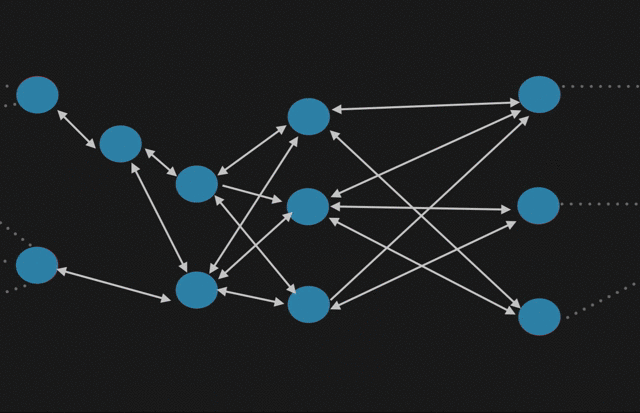

## 引言

在分布式系统中，节点之间的信息传播是至关重要的。Gossip 协议作为一种简单而有效的分布式信息传播协议，被广泛应用于各种分布式系统中。本文将带领读者从零开始，通过具体的场景和例子，深入探讨 Gossip 协议的工作原理和应用场景。

### 基本概念

Gossip，单词本身就是流言、八卦的意思。正如名字一样，Gossip 协议也被称为“流言协议”。它是一种分布式算法，用于在节点之间传递信息。在 Gossip 协议中，每个节点都可以将信息广播给它所知道的其他节点，这些节点又将该信息广播给它们所知道的其他节点，以此类推，直到整个网络都知道了这个信息。这种广播方式可以保证整个网络中的所有节点都能够及时地了解到最新的信息，并确保整个网络的一致性。

### 背景与意义

关于这个协议的详细论文可查看参考文献一。Gossip 协议通常用于分布式系统中，例如 P2P 网络、分布式数据库、分布式文件系统等。在比特币网络中，也使用了 Gossip 协议来广播新的交易和块。Cassandra 使用的数据复制协议也是 Gossip 算法。还有 Akka、Redis Cluster 都有用到。

这个算法的最终目的还是一个：达到集群中所有节点的数据一致。只不过这是最终一致性。

## Gossip 协议的基本原理

这个协议看似简单，实则很复杂。一个一传十、十传百的工作方式真正在分布式的环境下应用起来不是那么容易的。下面我们探讨下其实现细节。

理解这个协议可以从三个维度：通信方式、协调机制、传播过程。

### 通信方式

这里所谓的通信方式就是集群中的节点如何建立通信。协议里支持三种：pull、push、push-pull。

#### push 模式

节点 A 将数据 (key,value,version) 及对应的版本号推送给 B 节点，B 节点更新A中比自己新的数据

在推模式中，当一个节点（源节点）需要传播信息时，它会在每个 Gossip 周期（把两个节点数据同步一次定义算作是一个周期）主动将自己的本地数据发送给随机选择的目标节点。目标节点收到信息后，将根据接收到的数据更新自己的本地数据存储。

推模式的优势在于，信息能够迅速传播到其他节点。但是，它也可能导致节点之间的通信开销较大，因为每个节点在每个周期内都会主动发送信息，即使目标节点可能已经拥有了这些信息。

#### pull 模式

节点 A 仅将数据 key, version 推送给 B ，注意没有value哦， A 推送给 B 时，B 将本地比 A 新的数据（Key, value, version）推送给 A，A 更新本地，这一步相当于A在主动拉取 B 的值。

在拉模式中，节点不会主动发送信息。相反，它们会在每个 Gossip 周期主动向随机选择的目标节点请求数据。目标节点收到请求后，将自己的本地数据发送给请求节点。请求节点收到数据后，将根据接收到的数据更新自己的本地数据存储。

拉模式的优势在于，通信开销相对较小，因为节点只在需要时才会请求数据。然而，拉模式可能导致信息传播速度较慢，尤其是在节点数量较多的情况下。

#### push-pull 模式

与 Pull 类似，只是多了一步，A 再将本地比B新的数据推送给 B，B 再更新本地。

推拉模式结合了推模式和拉模式的优势，既能保证信息的快速传播，又能减小通信开销。在推拉模式中，当一个节点（源节点）需要传播信息时，它会在每个Gossip周期主动将自己的本地数据发送给随机选择的目标节点（推），同时也向目标节点请求数据（拉）。目标节点收到信息后，将根据接收到的数据更新自己的本地数据存储，并将自己的数据发送回源节点。

推拉模式的优势在于，它可以在保证信息传播速度的同时，降低通信开销。这种模式在大规模分布式系统中尤为突出。

### 传播策略

了解完通信方式，再来聊聊传播策略，也就是所谓的如何实现最终的一致性。主要有两种：Anti-Entropy(反熵传播)和Rumor-Mongering(谣言传播)。

#### Anti-Entropy(反熵传播)

Anti-Entropy 策略通过在节点之间交换数据的摘要来实现信息传播。在每个Gossip 周期内，节点会向随机选择的目标节点发送其本地数据的摘要。目标节点收到摘要后，会比较自己的本地数据和收到的摘要，找出不一致之处。然后，目标节点会向源节点请求缺失或过时的数据。通过这种方式，节点之间的数据最终将达到一致。Anti-Entropy 策略在通信开销和传播速度之间实现了一种平衡，适用于大规模分布式系统。

这种方式工作量大，一般用于新节点加入时同步更新数据的时候用得到。

- 适用场景：执行反熵时，相关的节点都是已知的，而且节点数量不能太多，如果是一个动态变化或节点数比较多的分布式环境（比如在 DevOps 环境中检测节点故障，并动态维护集群节点状态），这时反熵就不适用了。
- 缺点：消息数量非常庞大，且无限制；通常只用于新加入节点的数据初始化。可以通过引入校验和（Checksum）等机制，降低需要对比的数据量和通讯消息等。

#### Rumor-Mongering(谣言传播)

Rumor Mongering策略又称为传闻传播策略，它是一种概率论驱动的信息传播方法。在这种策略中，每个节点会在每个Gossip周期内随机选择一个或多个目标节点，并将信息发送给这些目标节点。当目标节点收到信息后，它们也会继续随机选择其他节点并将信息传播出去。这个过程会持续进行，直到信息在整个系统中被广泛传播。Rumor Mongering策略的优点是具有较低的通信开销和较高的可扩展性，但传播速度可能较慢。

这种方式工作量小，一般用于节点间数据增量的同步。

- 适用场景：适合动态变化的分布式系统。
- 缺点：系统有一定的概率会不一致，通常用于节点间数据增量同步。

### 工作过程

Gossip 协议的工作流程可以简化描述为几个过程：

- 种子节点在 Gossip 周期内散播消息
- 被感染节点随机选择N个邻接节点散播消息
- 每次散播消息都选择尚未发送过的节点进行散播

这个协议是建立在一定概率的情况下进行的，因为并不是所有节点都时时的能拿到数据，所以这个协议是一种最终一致性算法。

## 协议的应用于实践

### Apache Cassandra

Apache Cassandra是一种高度可扩展的、分布式的NoSQL数据库，它在很大程度上受到了Amazon Dynamo的启发。Cassandra中使用Gossip协议来实现节点间的成员关系管理、故障检测、元数据信息传播以及负载均衡。

#### 成员关系管理和故障检测

在Cassandra中，节点通过Gossip协议来维护成员关系信息。在每个Gossip周期，节点会与随机选择的其他节点交换成员关系信息。这样，节点可以了解其他节点的在线状态和故障情况。此外，Cassandra使用了一种名为Phi Accrual Failure Detector的故障检测机制，它依赖于Gossip协议收集的节点信息来检测节点的可用性。

#### 元数据信息传播

Cassandra中的节点需要维护一定量的元数据，例如分区信息、副本信息和令牌（Token）分配。Gossip协议被用于在节点之间传播这些元数据。在每个Gossip周期内，节点会将自己的元数据发送给随机选择的其他节点。这些节点在收到元数据后，会更新自己的本地数据存储，并将更新后的元数据传播给其他节点。这个过程会持续进行，直到元数据在整个系统中被广泛传播。

### Redis Cluster

Gossip 协议被广泛应用于各种分布式系统中，下面我们将介绍在Redis Cluster的应用场景，并将 Gossip 协议与真实场景结合起来。

Redis Cluster 是一个分布式的 Redis 解决方案，它允许将数据分布在多个节点上以提高性能和可用性。Gossip 协议用于节点之间的发现和状态同步，每个节点都了解整个集群的拓扑结构以及其他节点的状态信息，以便正确地路由请求和保证数据的一致性。

想象一下一个大型的工厂，里面有各种各样的生产线。每条生产线都有一个负责人，他们会定期与周围的生产线负责人交流，分享自己所在生产线的状态和工作情况。这样，即使有一部分生产线出现了问题，其他生产线也能够通过周围生产线的信息了解到整个工厂的状态。

Gossip 协议在 Redis Cluster 中的应用主要分为两个方面：

#### 节点发现

当一个新的节点加入到 Redis Cluster 中时，它需要能够自动地发现其他节点，并加入到集群中。这就需要一种机制来实现节点之间的自动发现，而 Gossip 协议恰好提供了这样的功能。每个节点会周期性地与其他节点交换信息，包括自己的地址和状态，从而使新加入的节点能够了解到整个集群的拓扑结构，并与其他节点建立连接。

#### 状态同步

在 Redis Cluster 中，节点之间需要保持数据的一致性，即使某个节点发生了故障或者新的节点加入。为了实现这一点，每个节点都需要了解其他节点的状态信息，如节点的存活状态、负载情况等。通过 Gossip 协议，每个节点可以定期地交换状态信息，从而保持集群中所有节点的状态同步，并及时地做出相应的调整和处理。

总的来说，Redis Cluster 中的 Gossip 协议通过节点之间的周期性交流信息，实现了节点的发现和状态同步，从而保证了集群的高可用性和一致性。

## 总结

文中介绍了 Gossip 协议的一些情况。这里简单总结下其优缺点：

### 优势

- 快速传播：由于Gossip协议基于随机节点选择进行信息交换，信息可以在很短的时间内传播到大部分节点，实现快速信息传播。
- 容错性：Gossip协议具有较高的容错性，即使某个节点发生故障或者无法与其他节点通信，信息仍然可以通过其他路径传播。
- 抗拥塞：随机选择目标节点有助于避免在特定节点上产生通信瓶颈。这使得Gossip协议可以在大规模分布式系统中高效运行。
- 可扩展性：Gossip协议的设计使得它可以很容易地适应大规模分布式系统，具有较好的可扩展性。
- 简单易实现：Gossip协议的设计和实现相对简单，易于在各种分布式系统中进行部署。

### 劣势

- 最终一致性：Gossip协议通常实现的是最终一致性，而不是强一致性。在某些应用场景中，这可能导致数据在短时间内不一致。
- 带宽消耗：由于Gossip协议的信息交换是基于概率的，可能会导致部分信息多次在节点之间传播，增加了网络带宽消耗。
- 信息冗余：Gossip协议可能会导致信息冗余，因为每个节点都需要存储关于其他节点的部分信息。
- 难以保证完全一致性：在某些情况下，由于网络延迟、故障等因素，Gossip协议可能难以保证系统中所有节点的完全一致性。
- 参数调优：Gossip协议的性能在很大程度上取决于参数设置，例如Gossip周期、目标节点数量等。在实际应用中，需要根据系统的特点和需求进行参数调优，以获得最佳性能。

## 参考文献

[Efficient Reconciliation and Flow Control for Anti-Entropy Protocols](https://www.cs.cornell.edu/home/rvr/papers/flowgossip.pdf)
[Wtf is Gossip Protocols?](https://pstree.cc/wtf-is-gossip/)
[P2P 网络核心技术：Gossip 协议](https://zhuanlan.zhihu.com/p/41228196)
