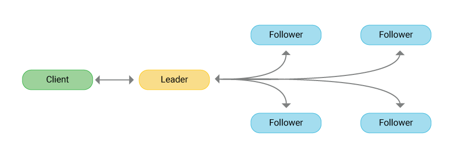

## 前言

Raft 算法是 Multi-Paxos 算法的一种，是一种强一致性算法。核心就是通过日志复制的方式达到整个集群的副本一致。

Raft 算法的三个核心概念就是 Leader 的选举、日志复制、节点变更。本文也将从这三个方面进行探讨。之后再聊聊 Raft 算法的几个应用场景。

## 原理

下面，我们就看看 Raft 算法的一些细节和流程。

### Leader 选举

Raft 算法中实现一致性的方法很简单：一切听领导的。分布式的环境下节点众多，达成一致最简单粗暴的方法不就是听一个节点的么。

#### 角色变换

Raft 算法中的每个节点都在三种角色之间变换着（一个时间点中一个节点只有一种角色）：Leader（领导者）、Candidate（候选者）、Follower（追随者）。

- **领导者**，整个集群的核心，其他的节点都追随这个领导者来复制日志内容。领导者主要负责客户端的写请求的处理、发送心跳（告诉其他节点我还活着，没有异常，请不要随便发起选举）、整理日志。
- **候选者**，当领导者节点出现异常（比如长时间没有收到领导者的心跳消息），这时候集群中的其他节点就会把自己的节点角色转为候选者，然后拉选票。最终根据选票数量决定是否成为领导者。
- **追随者**，领导者的小迷弟，永远追随着领导者（也有可能变成候选者或者领导者），主要负责从领导者那里复制日志。

在了解选举过程之前，先介绍几个概念：任期编号、随机超时时间

#### 任期编号

所谓的任期编号就是一个数字而已，每个领导者在任期期间都有一个编号，所有的追随者都以这个编号为准。这个任期在整个选举的过程中起到了至关重要的作用：

- 当某个节点长时间没收到领导者的消息，会把自己的任期+1，并且变成候选者
- 如果某个节点发现自己的任期编号比其他节点的小，那么会将自己的任期编号提高到编号大的那个值
- 如果某个节点发现自己的任期编号比其他节点的大，会丢弃这条消息
  
#### 随机超时时间

追随者有个特点：当长时间收不到领导者的消息就变成候选者然后去拉选票。那么这个长时间指的是多长时间？Raft 算法里的这个长时间是随机的一个时间，每个节点都不同且随机。

为什么超时时间是随机的呢？如果每个节点超时时间相同，那么有可能同时发起选票，那就有可能选不出最终的领导者，导致算法无法进行。

#### 选举过程

现在描述下 Raft 算法里的选举过程，假设集群里有三个节点：A、B、C

- 首先，起始状态下，集群中所有的节点都是追随者，但是 A 节点的超时时间（与领导者断联系的时间）短，所以A节点先别人一步，把自己变成候选者
- A 成为候选者后，把任期编号+1，然后投自己一票。接着再发消息给B、C 用来拉选票
- B、C 收到来自 A 的拉选票的消息后，检查下自己在 A 的任期编号下是否投票过、检查下这个任期编号是否合适，如果都满足条件，就把票投给- A，然后把自己的任期编号更新为 A 发过来的任期编号。
- 当 A 收到来自节点其他大多数节点的选票后，A 就会成为领导者。处理客户端的写请求、发心跳消息给追随者（防止追随者选举成为领导者）

选举的过程有几点注意：

- 一个任期内，除非这个领导者自己出现网络延迟等异常，否则会一直领导下去
- 如果追随者收到多个节点的拉选票的消息，采取先到先得的方式

> 除了以上的精简过程描述，raft 社区还提供了完整共识过程的可视化展示，这里可以通过[原理动画](http://thesecretlivesofdata.com/raft/)展示选举过程。 http://thesecretlivesofdata.com/raft/

### 日志复制

Raft 算法选举出领导者之后就能对外提供服务了。领导者接受客户端的写请求，然后记录日志、把日志更新给其他节点，最终整个集群达成一致。

这里的日志跟 MySQL 底层的那些个实现事物的各种 log 在原理和作用上是类似的。Raft 的日志是由日志项组成，每个日志项包含了一些指令信息、任期编号、索引值等内容。领导者的日志项式最全的（当然啦，因为所有人都听领导者的嘛）且索引值是按照一定的顺序排起来的，这样方便让其他节点查漏补缺。

#### 日志复制过程

那来自客户端的写请求是怎么个处理流程呢？大体如下：

- 第一步，领导者先处理写请求，创建新的日志项，写到领导者的本地日志中
- 第二步，领导者发送这条日志项给其他节点
- 第三步，当领导者收到大多数节点的回复（比如，其他节点说我已经收到新的日志项了），领导者将自己的状态机（可以理解为最终达成一致的那个状态数据库）更新一下，更新成把新的日志项加入后的最新状态。
- 第四步，领导者返还给客户端：你的写请求已经成功被我方执行，请放心。
- 第五步，领导者发在后续的心跳中告诉其他节点：你们可以更新自己的状态机为我现在的状态机的状态了。

非常类似两阶段提交方式的分布式事务……只不过做了点优化

#### 一致性的保障

上面的流程是正常的情况，如果发生非正常的情况，Raft 怎么保证其一致性？其实也挺简单粗暴：强制让追随者的日志项都与领导者一致，并且领导者的日志项永远不会被覆盖或者删除。具体怎么强制让追随者与领导者一致的呢？也很简单：发消息。

- 领导者有了最新的日志项，不是要发消息给追随者吗？这条消息里包含了领导者的前一条日志项的一些信息。
- 追随者收到消息后，检查下这条消息中的前一条日志项的信息是否与自己最新的日志项一致，如果一致，就追加这条最新的日志项到末尾。如果发现不一致，发送失败的消息给领导者。
- 领导者收到来自追随者失败的消息后，将前一条日志项打包成消息，这条消息包含了前前条日志项的信息。
- 追随者再次检查消息，跟第二步的检查机制一样，循环往复，直到找到与领导者相同的那条日志项为止。

总结下就是：领导者不停的通过消息与追随者确认两者之间最后一次一致的日志项在哪里，找到这条相同的日志项后，追随者直接强制把与领导者不同的日志项覆盖成领导者的日志项。当然，如果追随者落后的较多，这么一步步的往回走是很低效的，这种情况下领导者可以阶段性发送 snapshots，一次性把落后的节点的日志迅速的追回到某个 snapshots。

### 节点变更

这里我们继续探讨 Raft 算法中如何保持节点变更后领导者的一致性。领导者网络异常等可以从其他追随者重新选举来保持集群稳定。那如果集群中加入一个或者多个节点后，是否会导致集群不一致呢？如果操作不当，是会的。

想象这种情况，A、B、C三个节点，A 是领导者，B、C 是追随者，但是 C 是日志项的异常节点。如果这时候突然加了两台机器：D、E，好巧不巧的是 C、D、E 成为了一个新的小集群，然后 C 成为了领导，那就麻烦了。

如何解决上述的麻烦？也很简单粗暴：加机器的时候一台一台的加就行了。同样的，如果缩减机器也是一台一台的减少。

## 关于 Raft 的思考

任何算法、技术都在解决问题的同时带来了其他的问题。Raft 也一样，这里笔者总结下其弊端。

- Raft 算法依赖于一个领导者（Leader）节点来协调集群中的其他节点。这意味着领导者节点可能会成为一个性能瓶颈，特别是在处理大量读写请求的情况下。为了解决这个问题，可以采用一些优化策略，如领导者复制和负载均衡。
- Raft 算法依赖于集群中大多数节点的响应来达成一致。当集群规模增加时，需要更多的节点来达成一致，这可能导致更高的通信成本和更长的延迟。因此，Raft 算法在大规模分布式系统中的扩展性可能受到限制。
- 在某些情况下，Raft 算法可能需要几个网络往返才能达到一致性。这会导致一定程度的一致性延迟。对于对实时性要求较高的应用，这种延迟可能会成为一个问题。

## 参考文献

[In Search of an Understandable Consensus Algorithm](https://raft.github.io/raft.pdf)
[Raft Consensus Algorithm Definition](https://www.scylladb.com/glossary/raft-consensus-algorithm/)