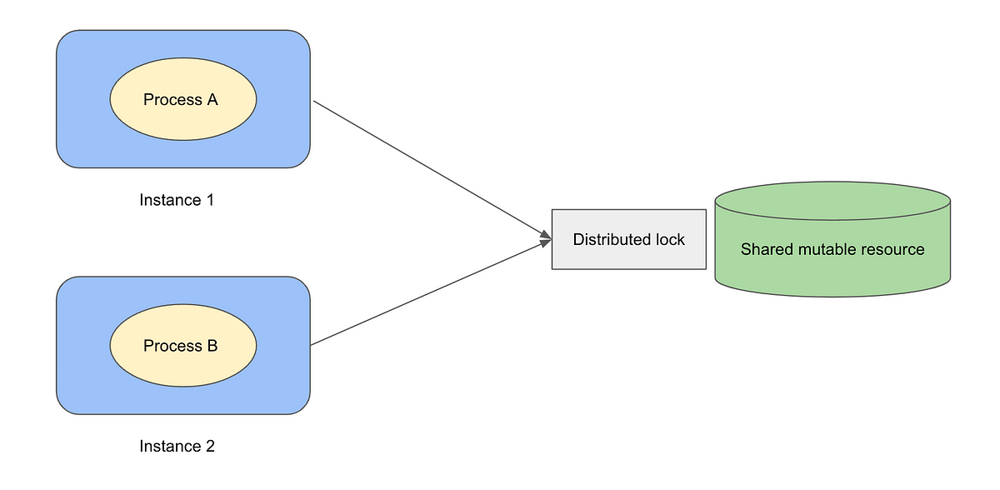

## 引言

在分布式系统中，多个节点同时访问共享资源可能导致数据一致性和并发控制的问题。分布式锁作为一种常见的解决方案，在这种情况下发挥着重要作用。

分布式锁是一种用于协调分布式系统中多个节点对共享资源的访问的机制。在分布式系统中，我们通常会遇到多个节点同时访问共享资源的情况，而分布式锁可以确保在任何时刻只有一个节点能够获得对共享资源的访问权。

## 实现方式

分布式锁的实现可以基于不同的技术和存储介质，包括基于数据库的实现、基于缓存的实现、基于分布式协调服务（如ZooKeeper）的实现等。每种实现方式都有其特点和适用场景，需要根据具体的业务需求和系统架构选择合适的实现方式。

设计分布式锁的时候，一般要遵循这几个要求：

- **互斥** ，有且只有一个进程能拿到锁且解锁的操作只能由加锁的进程执行（A拿到的锁不能让B释放）
- **超时机制** ，拿到锁的进程必须在规定时间内解锁（不然其他进程会一直阻塞）
- **机会平等** ，保持其他等待进程获取锁的机会是平等的（先到先得等思路）
- **可重入** ，同一个进程加的锁可以再次获得或者释放对应的锁

总的来讲，这把锁一定是放在外部存储介质上，根据存储介质的不同，笔者根据自己的实践总结出以下几个方法实现方案：MySQL、Redis、强一致性算法。

### MySQL

这种方式主要是用到了表的功能，毕竟 MySQL 的核心就是对表的操作嘛。具体的实现方式：

- 创建一张表，用以存储锁。设置表中的一列为唯一索引来作为排他性
- 获取锁时在数据库中添加一条记录
- 释放锁的时删除添加的那条记录

这是常规的用数据库表来实现分布式锁的步骤，不过很明显有两个严重缺陷：没有超时设置、没有重入。解决超时设置和重入问题也不是不行，代价挺高的。比如：

- 用 select **** for update，来解决超时设置问题
- 用 version 这种乐观锁的方式来解决重入问题

上面的解决方案加重了业务逻辑，况且性能不高（for update 可能会触发表锁等，version 的方式是为每一把锁都建立一张表），还有就是单点故障。所以，这种方案一般不会在生产中使用，这里拿来就是当个比较。

### Redis

既然 MySQL 的 方式有单点故障、性能等问题，那我们可以使用缓存数据库。最典型的就是 Redis 了。具体实现方式如下：

- 用 SETEX key seconds value 命令设置锁（这是个原子命令，seconds 是时间，key 就是锁的名字）
- 释放锁的时候直接 删除 key 的方式（如果删除操作也要确保原子特性的话，可采用 lua 脚本的方式）

这种实现方式有几个缺陷：

- 单点故障。虽然 Redis 有主从方式备份，但是主从方式是异步的。客户端1 在主上加锁成功，但是主挂了。从变成主之后还没来得及同步客户端1 的加锁操作，客户端2 在新的主上又加锁成功。导致两个客户端同时加了锁。
- 超时异常。客户端1 加锁成功，但是阻塞了。超时后客户端2 又拿到锁。这一个锁下有两个进程（一个阻塞、一个正常）可能引发线程安全问题
- 时钟漂移。客户端的时间比 redis 的时间晚了，会导致锁提前释放。

有鉴于此，有了个 RedLock 的方案，大体过程如下：

- 首先，redis 是多点部署的，不存在主从、集群协调之类，就是实实在在的多个 master 的 redis 进程
客户端获取时间戳。
- 使用同一个key和具有唯一值的value依次从 redis 的服务器上尝试获取锁（假设这里有 5 台 redis）
- 因为连接redis 是需要时间的，所以这个 key 的时间应当减去连接 redis 的耗时
- 当成功获取锁的个数超过 redis 服务器总数的半数以上，即可认为加锁成功（比如5台，获取了3台就算成功）
- 如果因为某些原因获取失败，对所有 redis 服务器进行删除锁的操作（防止加锁成功但获取响应失败）

总的来说，其实就是讲第一种方案做了个分布式的操作作为保障……但，这个也是有隐患的：

- 客户端1 在5 台 redis 服务器上正确获取到了三台（假设 A、B、C、D、E五台，获取到了A、B、C三台），加锁成功，但是C挂了触发了C的主从切换。这与此同时 客户端2 又在 C、D、E 获取锁成功。
- 网络连接的耗时决定了锁的有效时间

所以，任何一种方案都有缺陷和优点，看取舍了。选择了 redis 作为分布式锁，就是看中了其性能好的方面。但是终归不是强一致性的方案。需要在业务层面保障了，比如设置幂等操作等。

### 强一致性算法

Redis 的分布式锁方案最根本的隐患总结一句话就是存储锁的这个状态在节点之间（主从之间）并不能达成强一致。自然而然的就能想到基于强一致性算法的实现。这里以 etcd 为例谈谈实践方式。

首先 etcd 是一个基于 KEY-VALUE 的分布式一致性的存储系统，主要用来服务发现和共享配置。这里我们利用的就是利用 KEY-VALUE 的建立、获取来实现分布式锁。

- 利用 etcd 的 prefix 机制，让多个抢锁的进程（也就是 etcd 的客户端了）建立前缀相同、名称不同的 key。通过比较每个 key 的 revison 的大小来决定哪个先抢到的锁
- 利用 etcd 的 lease 机制设置 key 的超时时间。当然，这个 key 可以续约
- 利用 etcd 的 watch 机制来监听锁的释放

上述是常规的用 etcd 机制实现分布式锁的方案，其实 etcd 很贴心的为我们提供了一个叫 concurrency 的包来给我们是用，原理上就是对上述的业务逻辑进行了封装，拿来用即可。

## 方案选择

上述几个方案在不同的业务需求下可以有不同的选择，在选择的时候考虑的无非就是从性能、可用方面去考虑。那我们这里针对几种方案进行对比。

### 权衡利弊

针对性能、可用性方面的总结如下：

- MySQL 方式性能低、可用性差，几乎不作为生产的选择，一般作为分布式锁的入门理解
- Redis 方式性能高，但有状态不一致的隐患。如果生产上可以配置一些幂等操作的辅助，但代码复杂度就高了
- 强一致性算法方式性能比 Redis 低，但因为基于状态强一致性算法的原因，其可用性高。

所以，追求高性能场景，可以选取 Redis 方式。追求高可用的场景，选取强一致性算法方式。

### 思考

一般情况下，系统的可用性越高，其性能就越低。因为可用性方面我们需要考虑的地方就多了，必然带来一定的复杂度，其性能必然下降。

分布式锁作为一个基础组建，个人认为应该更关心的是可用性方面，毕竟都用到锁了，那说明资源的竞态已经是重中之重，能提高可用性就尽量提高。所以，生产上个人倾向于强一致性方面的实现，比如 etcd 或者 zookeeper 方式等。

## 参考资料

[Distributed Locks with Redis](https://redis.io/docs/manual/patterns/distributed-locks/)
[etcd concurrency](https://github.com/etcd-io/etcd/tree/v3.4.9/clientv3/concurrency)
[Design distributed lock with MySQL](https://medium.com/@bb8s/design-distributed-lock-with-mysql-9bc28ac59629)