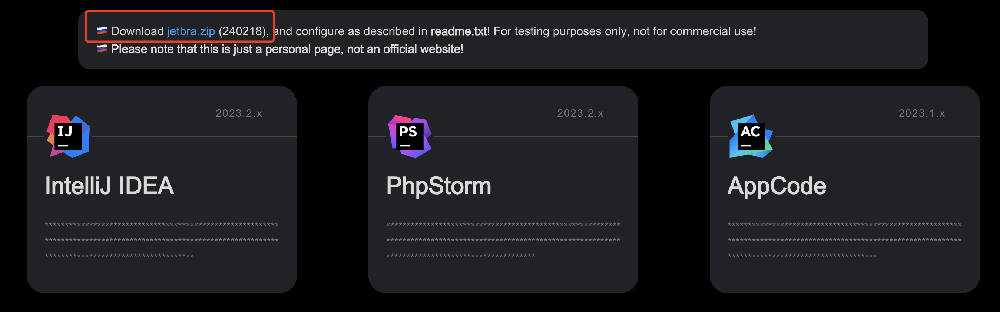
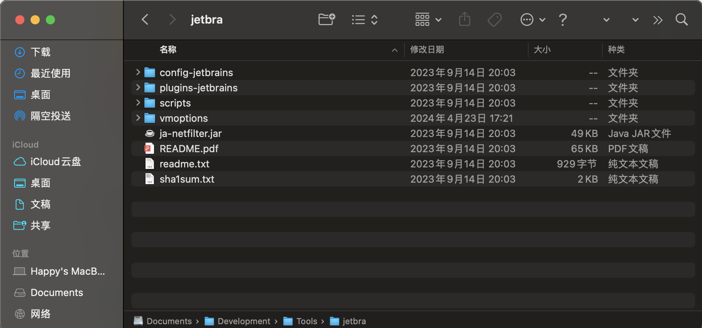
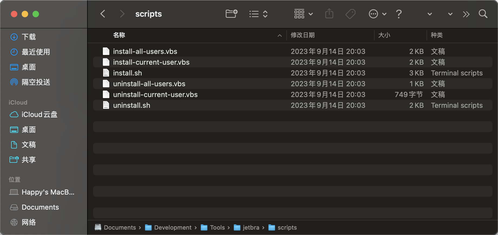
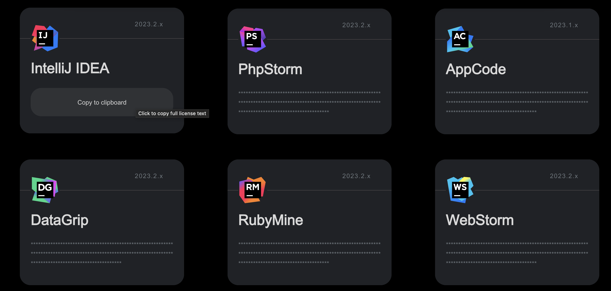
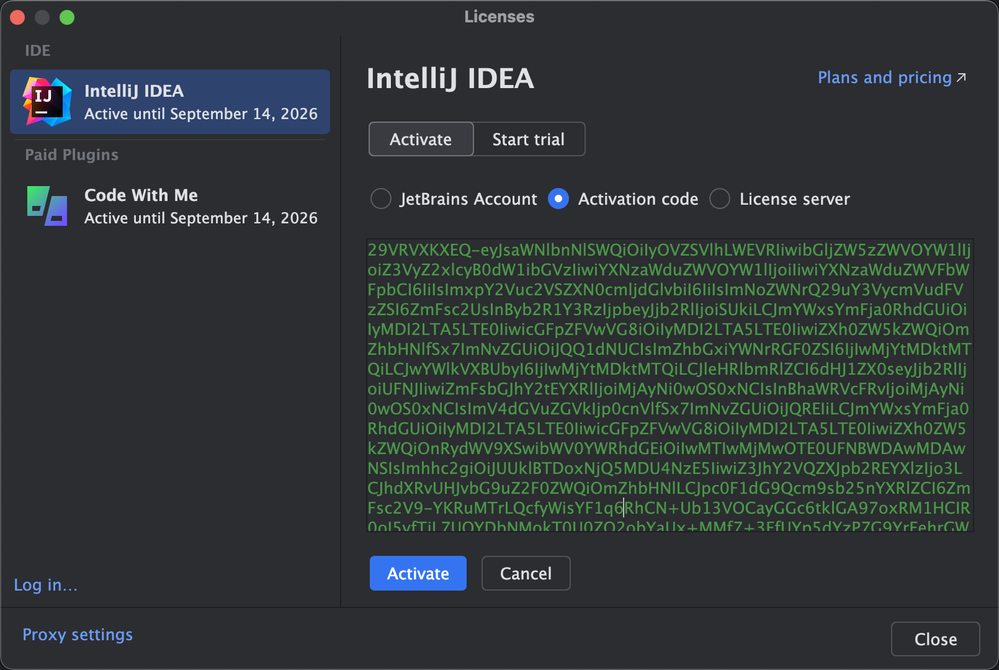
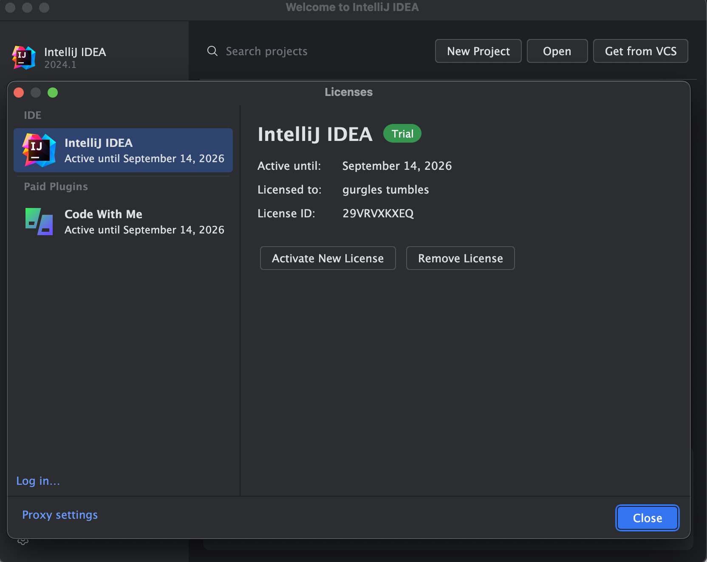

## 0. 前言

JetBrains 的产品提供了强大的功能、良好的用户体验、强大的社区支持、跨平台支持以及灵活的许可模式，能够满足开发者在软件开发过程中的各种需求，受到广大开发者的欢迎。

同时，JetBrains 的产品力尽管非常出色但因为价格昂贵，很多个人开发者都负担不起。如果您又想使用 IntelliJ IDEA Ultimate Edition（专业版），可以参考下面这种方式进行免费激活。

> 注意：本文提供方法来自网络，仅供测试使用，请勿用于商业用途，如果喜欢JetBrains的产品，请支持正版！

## 1. 下载安装

访问 [JetBrains IDEA 下载页面](https://www.jetbrains.com/zh-cn/idea/download) 下载合适的版本并完成安装。

安装完成后，请运行一次软件，进入到 *激活/试用* 界面后即可关闭软件。

## 2. 激活

激活工具`ja-netfilter`最初是zhile大神开发并发布于网络，后续并由热心大佬加工加工，打包成半自动化的激活工具`ja-netfilter-all`发布，很大程度上降低了使用门槛。

> 注意：下面的下载链接如已失效，请访问 https://jetbra.in/s 页面扫描并获取最新的地址

### 2.1 下载并安装“激活包”

首先，[下载激活包](https://cloudflare-ipfs.com/ipfs/bafybeiawsvnhqx5o2aqa37pvq7brlk7vqj2cpty3b5xac655bxbpqbpkq4/files/jetbra-ded4f9dc4fcb60294b21669dafa90330f2713ce4.zip)，下载后解压到自己预期的目录下（避免误删，此激活包在激活后仍然有用处），内容如下：

然后进入scripts目录，目录里面是安装脚本

- install.sh 用于Linux或者MacOS系统激活IntelliJ IDEA
- install-all-users.vbs 用于Windows系统针对所有windows用户激活IntelliJ IDEA
- install-current-user.vbs 用于Windows系统针对当前windows系统用户激活IntelliJ IDEA

> un开头的文件分别对应上面的卸载脚本。

根据自己的操作系统情况，选择对应的脚本执行即可完成激活包的安装。

### 2.2 获取并使用激活码

首先，[访问激活码发布站点](https://cloudflare-ipfs.com/ipfs/bafybeiawsvnhqx5o2aqa37pvq7brlk7vqj2cpty3b5xac655bxbpqbpkq4/)，选择对应的产品并点击复制激活码到剪切板。

然后，打开IntelliJ IDEA，点击 "Configure" -> "Manage License"。

选择 "Activation Code" 并粘贴刚刚复制的激活码。

点击左下角的的“Activate”按钮即可激活，激活信息如下：

到此，激活就已经完成了。
